<!--
   ╔═══════════════════════════════════════════════════════════════════╗
   ║                                                                   ║
   ║   KR8TIV / V2 · cyber-renaissance design atelier                  ║
   ║   github.com/kr8tiv-io/kr8tiv-io-v2-website                       ║
   ║                                                                   ║
   ║   "death to generic. too good to ignore. too real to forget."     ║
   ║                                                                   ║
   ║   built by hand by Matt @ kr8tiv-io · BY APPOINTMENT, BY INSTINCT ║
   ║                                                                   ║
   ╚═══════════════════════════════════════════════════════════════════╝
-->

<p align="center">
  <a href="https://kr8tiv.io">
    
  </a>
</p>

<p align="center">
  <a href="https://readme-typing-svg.demolab.com">
    
  </a>
</p>

<p align="center">
  <em>Built for founders who'd rather start a cult than a brand.</em>
</p>

<p align="center">
  <a href="https://kr8tiv.io"></a>
  <a href="https://github.com/kr8tiv-io"></a>
  
</p>

<p align="center">
  
  
  
  
  
  
  
  
  
</p>



## (i) — what this is

**KR8TIV is a cyber-renaissance design atelier** — a small, founder-led studio that builds brands, websites, motion, video, and full AI business systems for people who refuse to be forgettable. We don't do "modern, clean, minimal." We do *memorable, opinionated, alive*.

This repo is the source code for the studio's own site, [**kr8tiv.io**](https://kr8tiv.io). It's our proof-of-work. If we built this for ourselves, what do you think we'll build for you?

It is also — quietly — a public spec sheet. Every shader, every interaction, every line of CSS in here is something we'd ship for a paying client. Read it. Steal the patterns. Then [**book a call**](https://kr8tiv.io#start) and let us build the next one with you.


## (ii) — death to generic

> *We make work that is too good to ignore and too real to forget. We don't make landing pages, we don't make decks, we don't make AI-generated brand-slop. The market is full of those. The market is starving for the opposite.*

**What we make**

- Brands that have a *spine* — a doctrine, a voice, a typography that doesn't read like a Wix template
- Websites that *react* — magnetic cursors, WebGL prisms, scroll-pinned cinema, kintsugi navigation
- Motion that *carries weight* — every transition tells the user something about what kind of company they're dealing with
- Founder positioning so sharp it doubles as a recruiting pitch and a sales pitch

**What we don't make**

- Generic SaaS landing pages
- "AI-generated" slop dressed up with a Tailwind hero gradient
- Pitch-decks-shaped-like-websites
- Anything you've seen 200 times this year

If your first instinct on seeing this site was *"how did they do that?"* — that's the feeling we sell.


## (iii) — what's inside this build

A non-exhaustive tour of what shipped in this repo — written so a developer can sniff the bones, and a founder can see what they're paying for.

| Layer | What we did | Why it matters |
| --- | --- | --- |
| **Hero** | A WebGL chromatic prism shader stacked over CSS prism bars, refracting the live hero video through three offset UV samples (R/G/B), with cursor-driven caustics and Lenis-velocity tilt | First paint = "this is not a template" |
| **Navigation** | A 3-layer hybrid nav: contextual top bar that morphs by scroll-state (hero / body / final), an oracle quick-jump, and a kintsugi overlay menu with a 240-particle gravitational field | Navigation as a brand experience, not a hamburger |
| **Process page** | 12 visual elevations: kintsugi thread, ink-draw step counters, page-stitch dividers, marquee vinyl, gold-dust particles, k-word footnotes, heart audio, CTA shockwave | Every scroll position earns its keep |
| **Reel section** | Three.js volumetric prism slab + refractive mirror lake feeding off a shared VideoTexture, with a katana-trail FBO ping-pong + chromatic aberration display pass | Cinema, not stock footage |
| **Cursor** | State machine with four distinct visuals (default / magnetic / link / media) plus a soft brand-coloured trail (pink → purple → gold → red, additive blend) | The pointer is part of the brand |
| **Type** | Variable-axis fonts (Instrument Serif, Inter Tight, JetBrains Mono) with `--scroll-wght` driven by Lenis velocity — words *gain weight* as you scroll faster | Typographic motion that *responds* |
| **Motion toggle** | WCAG 2.2 SC 2.2.2/2.3.3 compliant, defaults to ON regardless of OS preference, persists in localStorage, wraps state flips in View Transitions where supported | Accessibility without blandness |
| **Performance** | Static build (Astro), `<link rel=preload as=video>` for hero, fetchpriority high, Speculation Rules prerender for variant pages, GPU-idle when hero scrolls out | LCP < 1.8s on a Moto G Power |


## (iv) — architecture you can steal

We're going to be transparent: most "WebGL agency sites" are a video tag and a CSS gradient. This one isn't. Here's a walking tour of three things in this repo that we're particularly proud of.

### a. WebGL prism with real chromatic aberration

The hero isn't a gradient — it's the actual hero video (`/3-4.mp4`) sampled three times with offset UVs, one per channel, then combined. Cursor position drives the offset magnitude. Lenis scroll velocity tilts the bars. Audio level pulses brightness.

```glsl
// fragment shader excerpt — src/lib/prismGL.ts
vec2 dir = normalize(uv - vec2(0.5));
float strength = 0.012 + uMouseDist * 0.018 + uAudio * 0.006;
vec3 col;
col.r = texture2D(uVideo, uv + dir *  strength).r;
col.g = texture2D(uVideo, uv).g;
col.b = texture2D(uVideo, uv - dir *  strength).b;
gl_FragColor = vec4(col, 1.0);
```

GPU goes idle when an `IntersectionObserver` notices the hero leave the viewport. No invisible canvas burning watts.

### b. Magnetic-particle navigation menu

The `kintsugi` site menu replaces the standard nav with a Canvas2D field of ~240 particles. They migrate toward the cursor with gravitational attraction, edge-wrap, and persist a soft motion trail via per-frame alpha-fill.

```ts
// src/lib/magneticField.ts — gravitational pull + drag
const dx = mx - p.x;
const dy = my - p.y;
const d2 = dx * dx + dy * dy + 0.01;
const f  = Math.min(0.15, 1200 / d2);   // close → slingshot, far → drift
p.vx += (dx / Math.sqrt(d2)) * f;
p.vy += (dy / Math.sqrt(d2)) * f;
p.vx *= 0.96;                           // drag
p.vy *= 0.96;
```

The colour is resolved at runtime from the CSS custom property `--accent-1` so the field re-tints automatically when the user flips dark/light theme.

### c. Multi-state nav driven by scroll + section markers

Sections opt-in to nav-state changes by adding `data-nav-state="hero|body|final"`. An `IntersectionObserver` watches them; a scroll threshold handles the gaps between tagged sections. The active state is written to `nav.dataset.navState`, and CSS reacts.

```ts
// src/lib/multiStateNav.ts — selection priority
//   1. Section with data-nav-state in view → use its state
//   2. Otherwise: scroll-Y < 80vh = hero, ≥ 80vh = body
const tagged = Array.from(document.querySelectorAll('[data-nav-state]'))
  .filter((el) => el !== nav);
```

This is also what tells the brand watermark (`Design-49.gif` K-pattern) to fade away on the splash and fade back in on the body — without touching component code.


## (v) — pages

| Path | What lives there |
| --- | --- |
| [`/`](https://kr8tiv.io) | The splash — KR8TIV logo reveal through a WebGL prism, hero hover heat-up, scroll-pinned doctrine obelisk, services horizontal-scroll, why-us, contact |
| [`/process/`](https://kr8tiv.io/process/) | Our process, told through 12 visual elevations and a kintsugi thread that follows your scroll. Step bodies in conversational, no-corporate-cringe voice |
| [`/work/`](https://kr8tiv.io/work/) | A four-tier honest portfolio: Selected work · Brand Kit · Studio Lab · Code Vault. Tagged transparently as **CLIENT**, **OWN COMPANY**, or **PERSONAL R&D** |
| [`/terms/`](https://kr8tiv.io/terms/) | Privacy + Terms, with the same prism-and-video header as process. We read the legal doc so you can read it too |
| [`/build-notes/`](https://kr8tiv.io/build-notes/) | Long-form technical writeups — for the developers who like to look under the hood before signing a contract |


## (vi) — tech stack

```
front-end           Astro 5 + Vite + TypeScript (strict)
3D / WebGL          Three.js (custom shaders, FBO ping-pong, instanced meshes)
2D                  Canvas2D (magnetic field, cursor trail, kintsugi cracks)
animation           GSAP 3.13 (SplitText, ScrollTrigger) + custom rAF loops
smooth scroll       Lenis (slaved into GSAP's ticker for buttery 60fps sync)
type                Instrument Serif · Inter Tight · JetBrains Mono · Orbitron
                    (variable axes, font-variation-settings driven by scroll)
sound               Web Audio API (AnalyserNode → music note pulse)
build               Astro static + Speculation Rules prerender + view transitions
hosting             Hostinger (with MCP automation) · also runs on
                    Vercel / Netlify / Cloudflare Pages with zero config
package manager     pnpm
language            TypeScript strict mode end-to-end
ci                  type-checking via `astro check`
tooling             Claude Code (Matt-Aurora-Ventures branch authorship),
                    custom Hostinger MCP, Hugo-style component conventions
```


## (vii) — performance

We treat performance as part of the brand. A site that says "cyber-renaissance" but takes 6 seconds to paint is lying.

- **LCP target**: < 1.8s on Moto G Power 4G
- **Hero video**: preloaded via `<link rel=preload as=video fetchpriority=high>` so it's available for the LCP paint
- **Fonts**: variable axes preloaded as `woff2` with `crossorigin`
- **JS**: per-island only — Astro tree-shakes everything you don't see
- **GPU**: WebGL prism + Three.js scenes wrapped in `IntersectionObserver` so they sleep when off-screen
- **Speculation Rules**: prerender neighbouring variant pages so the variant-bar feels instant on Chromium
- **Reduced motion**: `motion-off` toggle pauses the entire motion stack, including cursor trails, magnetic field, prism animation, and kinetic type
- **Resilience**: every client-side init is wrapped in a `safe()` try/catch — one stale dep cache cannot cascade into a black screen


## (viii) — local dev

```bash
# clone + install
git clone https://github.com/kr8tiv-io/kr8tiv-io-v2-website.git
cd kr8tiv-io-v2-website
pnpm install

# dev server (HMR, type-checking, source maps) at http://localhost:4321
pnpm dev

# static build into ./dist
pnpm build

# preview the production build locally
pnpm preview

# type-check without bundling — fastest CI gate
pnpm typecheck
```

Drops cleanly onto **Vercel**, **Netlify**, **Cloudflare Pages**, or any static host. Build command: `pnpm build`. Output: `dist/`.


## (ix) — who built this

This site was hand-built by **[Matt](https://github.com/Matt-Aurora-Ventures)** — founder of [**KR8TIV**](https://kr8tiv.io), [**Aurora Ventures**](https://github.com/Matt-Aurora-Ventures), and [**Meet Your Kin**](https://github.com/kr8tiv-io). Brand alchemist, founder-led, lean and hungry. Happy in luxury, native to crypto, fluent in Web3, allergic to account managers.

> *Cyber-renaissance is what happens when a designer who grew up in motion graphics, a developer who never accepted "good enough," and a founder who's tired of being forgettable — turn out to be the same person.*

You can find me here:

- **Studio org** — [github.com/kr8tiv-io](https://github.com/kr8tiv-io)
- **Personal handle** — [github.com/Matt-Aurora-Ventures](https://github.com/Matt-Aurora-Ventures)
- **Live site** — [kr8tiv.io](https://kr8tiv.io)
- **Booking** — [kr8tiv.io/#start](https://kr8tiv.io/#start) · *by appointment, by instinct*


## (x) — work with us

We take a small number of projects per year. We don't do "agency". We don't have account managers. You will work directly with the person who designed the prism shader you're staring at right now.

If you build something — a brand, a token, a fund, a community, a piece of software — that you genuinely believe should be **too good to ignore and too real to forget**, then we are interested in talking to you.

Bring us:

1. A founder. Not a procurement team.
2. A point of view. We can sharpen, we can't summon.
3. Trust. We are bespoke, not retainer-fast.

We bring everything else.

**[→ start a project](https://kr8tiv.io/#start)** · *first call is no-obligation, second call is where the cult starts.*

<br/>
<br/>

<p align="center">
  
</p>

<p align="center">
  <sub>© 2026 KR8TIV. All rights reserved. Source published as proof-of-work; reuse of brand, copy, shaders, and visual systems is reserved to the studio.</sub>
</p>

<p align="center">
  <sub>侍 · cyber-renaissance design atelier · (VIII) PRISM</sub>
</p>
